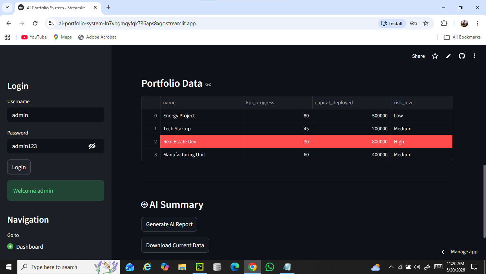
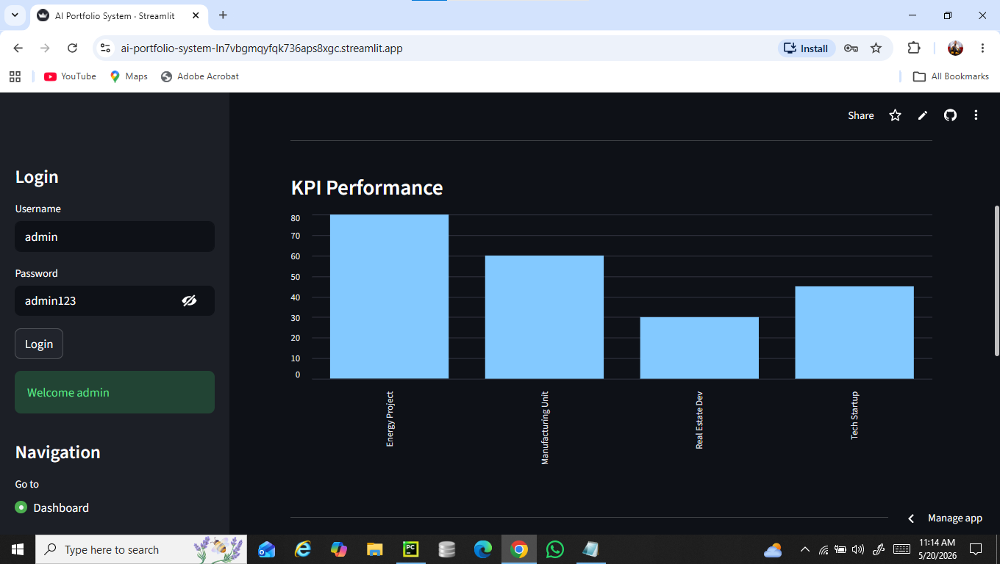
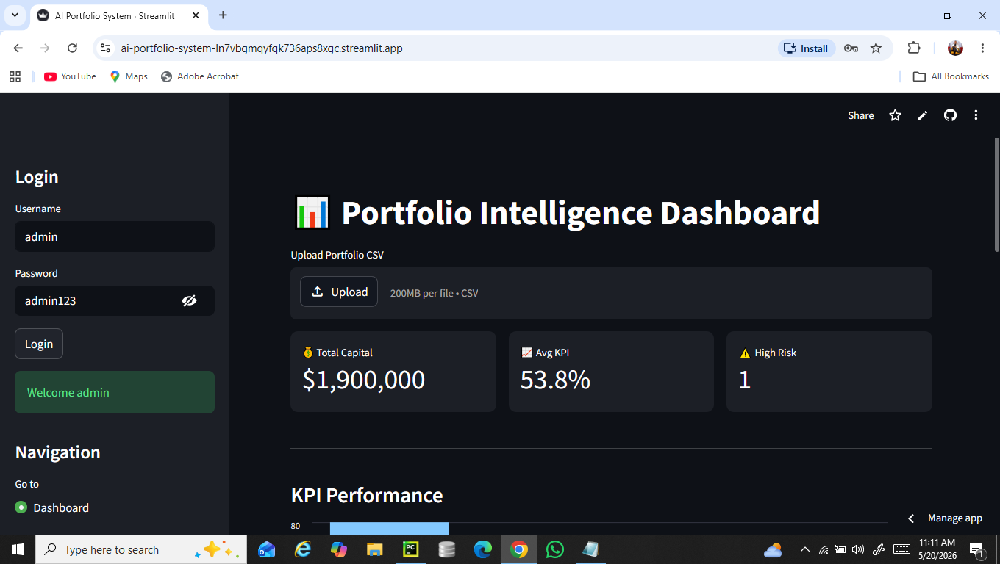

🚀 AI Portfolio System
Turn Data Into Smarter Investment Decisions
AI Portfolio System is an intelligent investment analytics platform designed to help individuals and organizations understand, optimize, and grow their portfolios using data-driven insights and machine learning.
Instead of reacting to market changes, users can proactively identify risks, uncover opportunities, and make confident financial decisions — all from a single, intuitive dashboard.
📊 Analyze Your Portfolio
Get a complete breakdown of your assets, performance trends, and allocation.
⚠️ Detect Risk Early
Identify high-risk investments before they negatively impact your returns.
💡 Get Smart Recommendations
Receive AI-powered suggestions to rebalance and optimize your portfolio.
📈 Visualize Everything
Understand complex financial data through clean, interactive charts.
🔄 Stay Updated in Real-Time
Track performance dynamically as market conditions change.

🛠️ Built With
Frontend: React / Streamlit
Backend: Python (Flask / FastAPI)
Data Processing: Pandas, NumPy
Machine Learning: Scikit-learn
Visualization: Plotly / Matplotlib
Database: PostgreSQL / MongoDB

## 📸 Screenshots

### 🏠 Portfolio Data & AI Summary

### 📊 Dashboard

### 📊 KPI Performances Chart
